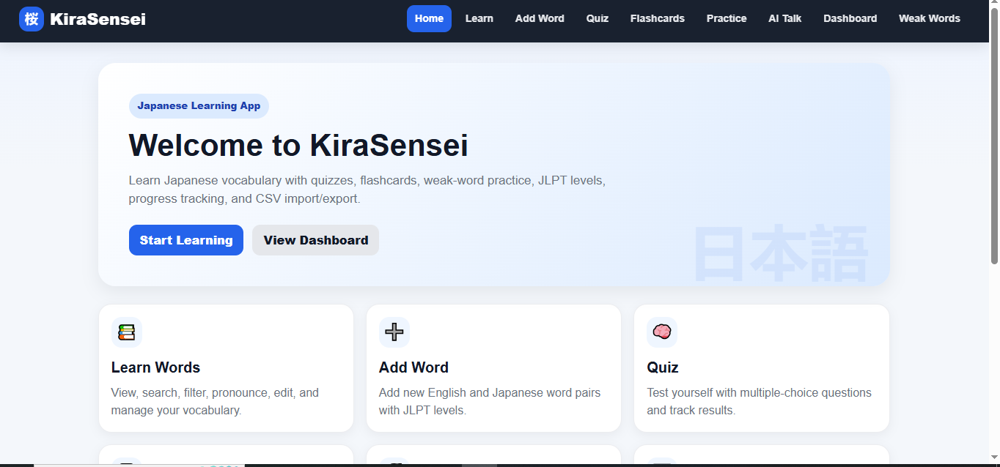
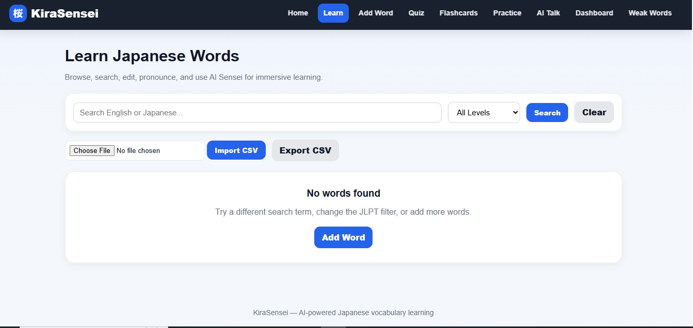
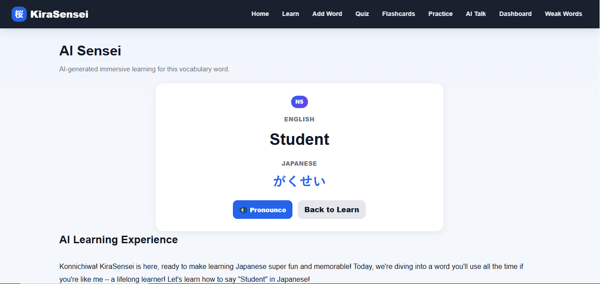
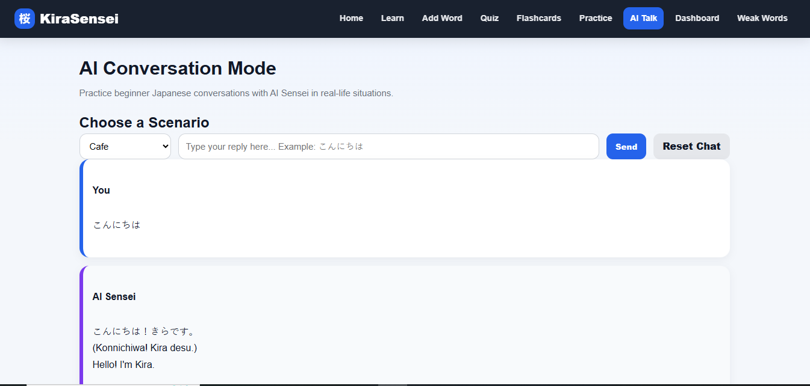
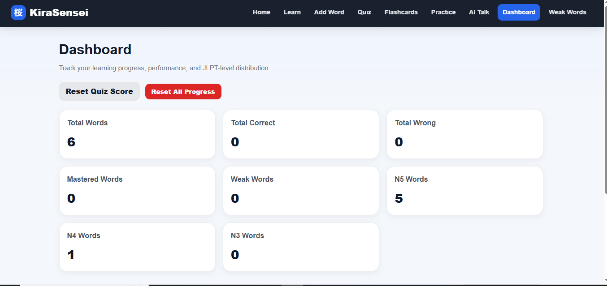

# 🌸 KiraSensei

KiraSensei is an AI-powered Japanese vocabulary learning web application built using Flask and SQLite.

The project is designed to help beginners learn Japanese vocabulary in a more immersive and interactive way using quizzes, flashcards, AI-generated explanations, and AI conversations.

---

# 🚀 Features

## 📘 Vocabulary Learning
- Add Japanese vocabulary words
- Edit and delete words
- JLPT level support (N5, N4, N3)
- Search and filter words

---

## 🧠 AI Sensei
AI-generated learning experience for every word:
- Anime-style memory scenes
- Example Japanese sentences
- Romaji pronunciation
- English translation
- Beginner learning tips

Powered by Gemini AI API.

---

## 💬 AI Conversation Mode
Interactive Japanese conversation practice:
- Cafe conversations
- Anime school scenarios
- Tokyo street roleplay
- Beginner-friendly Japanese dialogue
- English support and corrections

---

## 📝 Quiz System
- Multiple-choice Japanese quiz
- Dynamic random questions
- Score tracking
- Correct/wrong answer tracking

---

## 🎴 Flashcards
- Interactive flashcards
- Japanese ↔ English learning
- Clean animated UI

---

## 📊 Dashboard
- Total words statistics
- Mastered words tracking
- Weak words analysis
- Recently reviewed words

---

## 🔥 Weak Words System
Tracks difficult vocabulary automatically based on quiz performance.

---

## 📁 CSV Import / Export
- Import vocabulary from CSV files
- Export vocabulary database
- Easy backup and migration

---

# 🛠️ Technologies Used

- Python
- Flask
- SQLite
- HTML5
- CSS3
- JavaScript
- Gemini AI API

---

# 📸 Screenshots

# 📸 Screenshots

## 🏠 Home Page


---

## 📘 Learn Page


---

## 🤖 AI Sensei


---

## 💬 AI Conversation Mode


---

## 📊 Dashboard


# ⚙️ Installation

## 1. Clone the repository

```bash
git clone https://github.com/Rohittt-commits/kiraSensei.git